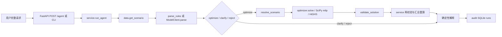
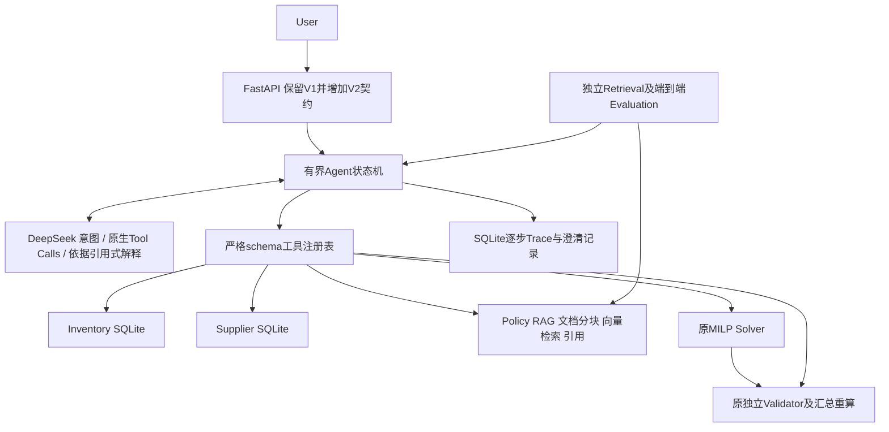

# SupplyChain Agent V2 开发前审计

日期：2026-09-08。此审计在修改业务源码前完成。项目使用 synthetic/demo data，由 AI 辅助开发，不是 ABB 内部系统。仓库整体尚未纳入 Git 跟踪，因此另存文件哈希清单作为改动基准。

## 1 当前目录

```text
supplychain-agent/
  src/supplychain_agent/
    schemas.py       严格 Pydantic 数据契约
    data.py          5 SKU 合成场景
    language.py      受限规则解析与 DeepSeek JSON 请求
    optimizer.py     MILP、独立验证、不可行诊断
    service.py       固定编排与成本汇总复核
    api.py           FastAPI、本地并发上限
    audit.py         SQLite 请求及响应记录
    evaluation.py    V1 冻结评测与来源归因
    cli.py           ask/chat/demo/evaluate/serve
    __init__.py
  tests/             4 个测试文件
  evals/             原始 cases.jsonl 和修订 cases-v1.1.jsonl
  reports/           原始开发错误、修订结果、首次留出、模型/API演示与规模检查
  docs/              数学模型、评测协议、验收、面试及简历边界
  scripts/benchmark_solver.py
  pyproject.toml uv.lock Dockerfile .dockerignore .env.example Makefile
```

已阅读全部 Python 源码、测试、CLI/脚本、两版用例、README、已有设计与验收文档；检查了历史评测的元数据、逐例输入输出及失败记录。历史报告不覆盖、不倒填。

## 2 当前端到端链路



`/plan` 接受自定义 Scenario 与 PlanParameters；`/scenarios` 返回合成数据；`/runs`、`/runs/{id}` 提供本地审计。`chat` 每条请求独立计算，没有对话状态恢复。

## 3 模块与现有保障

| 组件 | 实现 | 已有能力 |
|---|---|---|
| LLM | language.py ModelClient | HTTPS/本地地址约束、密钥环境变量、禁止重定向转发、JSON严格解析、有限HTTP重试、usage及实际调用归因 |
| Solver | optimizer.py solve | 单仓单期整数补货、MOQ、供货上限、交期、预算、保护/排除、逐SKU服务水平；不自动放宽约束 |
| Validator | optimizer.py validate_solution | 不读求解矩阵；从原始业务输入复算数量、成本、库存平衡、整数与非负、约束 |
| 二次校验 | service.py | 再调用验证器并重算汇总成本、预算、满足率；阻断被篡改的结果 |
| FastAPI | api.py create_app | schema、404/422、4个计算任务上限、health与交互文档 |
| SQLite | audit.py AuditStore | 参数化SQL、WAL、显式关闭连接；仅记录请求和最终响应 |
| Evaluation | evaluation.py | 分子分母、错误归因、调用计数、token未知值、耗时、源码/数据哈希、不覆盖报告 |

## 4 测试与评测基线

现有测试文件分别覆盖语言边界、30个微型穷举oracle及求解/验证边界、服务与SQLite、评测分母/冻结/错误归因。原验收记录报告232项测试通过；本次独立复跑命令为 `.venv/bin/python -m pytest --junitxml=/private/tmp/supplychain-v2-baseline.xml`，其实际输出随后归档到 evaluation/evidence，不将旧报告当作本次执行结果。

V1有24条开发请求、12条留出请求。原始两版文件完整保留；test字节一致。历史规则与LLM留出均为12/12严格意图匹配，LLM含11次真实模型调用和1次本地守卫，7个输出方案通过校验。这不是裸模型准确率，也不能证明LLM优于规则。V2复跑这些数据只能称V1回归，因为本次审计已阅读。

已注意到历史开发错误：零预算误澄清、负数需求误拒绝、保护与禁采被误当逻辑矛盾、整体服务率与逐SKU约束混用。保留错误报告及相应回归测试。

## 5 为什么仍更接近固定工作流

模型只返回三个动作及允许的参数；后续求解与验证顺序由service写死。它没有工具目录、模型生成的工具调用、工具结果反馈后的下一步决策，也无法只查库存/供应商/政策。数据是Python常量；解释为模板；SQLite不是业务数据库或逐步状态存储。具备良好的受控工作流基础，但不能据此声称实现通用自主Agent。

## 6 建议的V2架构及设计取舍



### 编排

先评估[LangGraph官方定位](https://docs.langchain.com/oss/python/langgraph/overview)：适合长生命周期、持久执行与复杂人机介入。本项目是同步、本地、工具少的有界请求，暂用显式Python状态机，避免把既有函数套一层框架。状态、分支、预算、失败恢复均独立建模与测试。未来需要暂停任务后跨进程续跑时再迁移，不把当前SQLite记录称为LangGraph checkpoint。

LLM先识别意图，然后根据工具返回结果发起原生Tool Calls；优化参数锁定，失败不能偷偷改预算。最终解释由LLM选择证据引用和简短说明，数据库事实与优化数值由代码呈现；不能让LLM自由发明或替换业务数字。[DeepSeek Tool Calls文档](https://api-docs.deepseek.com/guides/tool_calls/)

### RAG

使用小型合成采购制度库、稳定chunk ID、原文与source hash。选择进程内FAISS精确检索，不启用独立向量数据库服务。离线模式用明确标记的词项向量；可选多语言预训练embedding进行真正语义检索，模型不可用时明确报错或由用户显式选择离线模式，不伪装成神经embedding。分别记录embedding模式与检索结果，不默认需要reranker。[FAISS文档](https://github.com/facebookresearch/faiss/wiki/Getting-started)

采购规则的硬约束仍在确定性模型中实现。RAG用于找到依据与解释，不允许检索文本重写工具权限或静默修改硬约束；审批制度作为需要人工执行的业务提示，不伪装成已完成审批。

### 数据与工具

增加 inventory、suppliers、sku_supplier、purchase_orders、policy_documents 数据表。保留单SKU固定供货渠道，暂不做供应商选择优化。查询全部参数化；业务数据必须来自数据库快照。已在途数量只按明确计划窗口确定是否可用，不宣称逐日库存模拟。

工具至少为 inventory_query、supplier_query、policy_retrieval、replenishment_optimizer、solution_validator。purchase_orders存在实际在途查询用途时再暴露order_query。所有工具只读或本地计算，不下单、不改主数据。

## 7 修改与新增计划

| 阶段 | 新增/修改 | 验证 |
|---|---|---|
| Phase 1 | V2契约、业务DB/schema/seed、工具注册与Solver/Validator适配 | 原测试+DB/工具单测 |
| Phase 2 | 合成制度文档、chunk/embedding/FAISS、引用数据契约 | 检索和边界测试 |
| Phase 3 | 原生tool-call客户端、显式状态机、受控解释、trace/澄清续接、V2 API | 路由/状态/异常集成测试 |
| Phase 4 | 独立V2 dev/test及retrieval集、冻结清单、指标与runner | 先dev，冻结实现后运行test，保留失败 |
| Phase 5 | 补足有价值的故障注入与端到端验证 | 全部pytest，统计新增与原有数量 |
| Phase 6 | 锁依赖、Docker非root/持久目录/healthcheck、环境说明 | build/run实测或记录环境缺口 |
| Phase 7 | README、架构、示例trace、限制 | 命令与引用校验 |
| Phase 8 | 全量回归、V1数据完整性、API与安装包冒烟 | 归档命令和结果 |
| Phase 9 | 最终报告、简历证据表、改动清单 | 所有数字引用实际产物 |

## 8 必须保留

保留原CLI、`/agent`旧请求契约、`/plan`、场景和审计接口；新增版本参数或专门V2入口，避免把旧规则请求悄悄改成另一语义。保留全部旧测试、原始评测字节和历史结果。保留独立验证、有限重试、密钥隔离、所有约束与solver状态区分。

## 9 技术债和风险

- 模型可能选错工具或误解参数；schema合法不等于语义正确，必须独立评估。
- 自由LLM解释可能捏造业务事实；采用受约束引用式解释与确定性事实区，原始LLM输出分开保存。
- 业务快照与工具查询可能不同步；按请求固定数据版本及哈希，Trace保存输入依据。
- 现有求解器内部已经调用Validator，V2仍需显式验证工具覆盖汇总，禁止跳过对外认证。
- SQLite仅适合本地小并发；无认证、租户隔离、企业授权，不应公网裸部署。
- 模型HTTP超时不等于整体截止；增加总轮数/工具数/重试上限和阶段剩余预算，准确描述取消能力。
- 引入在途必须明确窗口内可用量，并避免重复计算；固定供应渠道不自动等同供应商选择算法。
- V1 wheel对评测文件路径有工作目录依赖；V2资源通过包资源访问，并测试安装包包含数据。
- 当前未检测到Docker CLI。后续实际尝试并记载结果，不能把Dockerfile存在称为容器验证成功。
- 新留出集由同一开发者创建，只能称自建留出，不是独立外部盲测；不能根据test失败调标签。
- 未知usage/失败重试成本不能当零。费用仅在usage及明确单价配置完整时估算，并标币种、费率来源和日期。

审计结论：现有优化与验证边界值得复用。V2重点是业务工具、可追踪的模型决策、规则证据和分层评测；不扩展多智能体、微服务、K8s或训练大模型。

## 执行后补记（保留以上修改前审计）

修改前基线实际运行 232 项全部通过。最终采用显式状态机、DeepSeek 原生工具调用和状态约束下的顺序工具批次；没有引入 LangGraph。RAG 实现为 TF-IDF 词法 embedding + FAISS，早期考虑的预训练多语言 embedding 最终没有实现，不作为已完成能力。

V2 最终 269 项测试通过。冻结后合成留出请求成功 22/24，独立检索 Hit@3 为 11/12；保留失败案例及所有开发尝试。Docker build/run 因主机没有 Docker 命令未验证；本机真实 HTTP 与 Wheel 检查通过。最终实现与未完成项以 [AGENT_V2_FINAL_REPORT.md](AGENT_V2_FINAL_REPORT.md) 为准。
