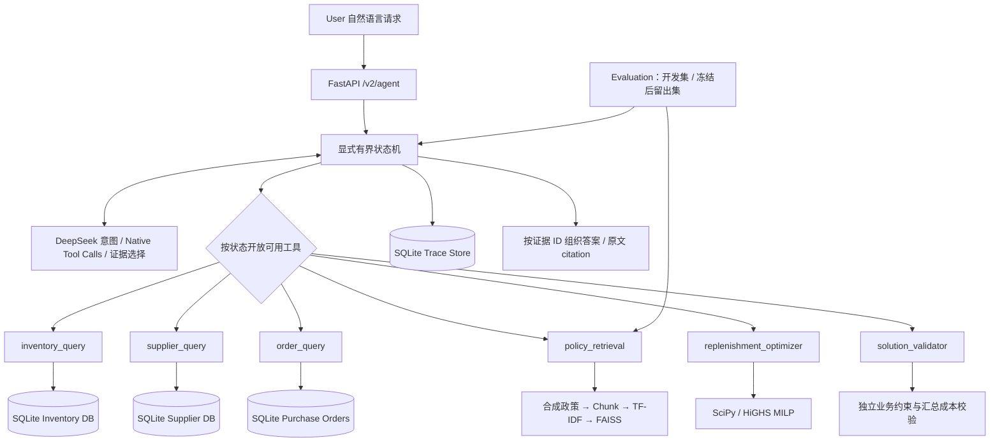

# 面向供应链补货的 LLM 决策 Agent · V2

**DeepSeek 理解任务并选择工具，SQLite 提供事实，SciPy/HiGHS 求解 MILP，独立 Validator 决定方案能否发布。** 查询库存、供应商、订单和采购规则时，系统按任务调用对应工具。

这是校招工程项目，采用 **synthetic / demo data**，包含 **AI-assisted development**。它不是 ABB 内部系统，不使用或泄露公司数据，不代表真实企业生产部署。运行数字可追溯到仓库中的测试与评测文件。

## 当前证据

| 实验 | 实际结果 | 证据 |
| --- | --- | --- |
| Pytest | 原 232 项，新增 37 项，共 269 项通过 | [测试记录](evaluation/evidence/test_summary.json) |
| 真实 DeepSeek 开发集 | 端到端 14/14 | [逐例记录](evaluation/runs_v2/dev_llm_final.json) |
| 冻结后合成留出集 | 端到端 22/24（91.67%） | [评测报告](evaluation/report_v2.md) |
| 独立检索留出集 | Hit@3 11/12；Recall@3 0.875 | [检索记录](evaluation/runs_v2/retrieval_heldout.json) |
| 无密钥真实 HTTP 启动及重验 | 通过 | [HTTP smoke](evaluation/evidence/http_smoke.json) |
| Wheel 构建及政策打包 | 通过 | [Wheel 检查](evaluation/evidence/wheel.json) |
| Docker build/run | 未验证：验收机器没有 Docker | [实际尝试](evaluation/evidence/docker.json) |

留出数据由同一 AI 辅助开发过程编写，规模很小，**不是第三方盲测**。意图和工具指标包含状态机约束及防护，不能当作纯模型开放工具能力；没有实测业务降本比例。

## 背景与问题定义

在给定库存、在途到货、需求、单价、MOQ、供货上限、交期和预算下，决定每个 SKU 的整数采购量，最小化采购成本、期末持有成本与缺货惩罚之和。合成场景含 5 个 SKU、3 家固定供应商和 3 条已有采购订单。

用户可以修改预算、计划窗口、逐 SKU 最低服务水平、保护/禁止采购清单和需求量。系统只生成建议。纯 LLM 适合理解表达，但不能作为库存事实或约束可行性的最终判断；本项目让确定性工具负责这些环节，并保留每条建议的数据快照与规则原文。

## 架构



代码在 [`src/supplychain_agent/v2`](src/supplychain_agent/v2)。V1 的模型客户端基础、Pydantic 模型、求解器、独立校验器继续复用，旧接口和原有测试保留。

## 六个业务工具

| Tool | 职责 | 来源 |
| --- | --- | --- |
| `inventory_query` | 现货、在途、需求、窗口内可用库存 | 同一请求的 SQLite 快照 |
| `supplier_query` | 供应商、单价、MOQ、上限、交期和资质 | 同一业务快照 |
| `order_query` | 只读已有订单，支持空结果 | 同一业务快照 |
| `policy_retrieval` | query、top_k → 原文、评分、citation、源 hash | 合成采购文档 |
| `replenishment_optimizer` | 按锁定意图生成 proposal id 和求解状态 | 原 MILP Solver |
| `solution_validator` | 根据实际 proposal id 独立校验，重算成本 | 原 Validator + 汇总校验 |

另有 `finish_request`，仅为模型结束信号，不计业务工具。Pydantic 拒绝多余字段和非法类型，数据库使用参数化 SQL；LLM 不执行 SQL，也不能新增供应商、修改价格或下单。优化前必须查询全部库存和供应商、取得政策依据；可行 proposal 通过校验后才能出现在响应 `result` 中。

## Agent workflow

`demo` 使用保守的完整句式 DSL；`llm` 调用真实模型，失败不自动切换 demo。LLM 选择意图、参数、允许范围内的工具顺序和批次、最终证据组织。状态机强制先决条件，求解与校验必须依次执行。

| 任务/状态 | 行为 |
| --- | --- |
| 直接优化、查询后优化 | 数据和政策 → 求解 → 校验 → 引用解释 |
| 库存、供应商、订单查询 | 对应只读工具，不运行 solver |
| 规则查询 | 检索并引用政策，不运行 solver |
| 信息不足、含糊或不支持的条件 | `needs_clarification`，不执行工具 |
| 绕过约束、改主数据、实际下单 | `rejected` |
| Solver infeasible | `infeasible`，给出诊断并保留用户约束 |
| 工具/模型/校验失败 | 对应 failure 状态，保留 trace，隐藏未确认方案 |
| 执行超限 | `limit_exceeded` |

默认最多 10 次业务工具尝试、12 次逻辑模型调用；HTTP 和可重试工具各最多重试 1 次，总重规划/格式修复 2 次，每个模型批次最多 4 个工具。批次顺序执行，每次调用记录当时的可选工具列表。

请求预算 60 秒，工具预算 5 秒；HTTP 有连接/读取超时，HiGHS 接收剩余求解时间。总时限采用边界检查，普通同步工具执行后检查耗时，**不是能强杀任意阻塞函数的硬实时隔离**。

数字参数需要原请求中明确的阿拉伯数字；数词、隐含比例或自行补出的数字可能要求澄清。这个防护不证明所有数字与语义的对应都正确。`previous_request_id` 只关联此前澄清记录，新请求须提交完整替换条件，不自动合并多轮约束。

评估后未使用 LangGraph：当前为短同步请求、少量工具及有限分支，Python 状态机足够；SQLite 保存轨迹，不宣称跨进程暂停/恢复。若需要人工审批中断、持久 checkpoint 或长任务再考虑迁移。框架定位参考 [LangGraph 官方概述](https://docs.langchain.com/oss/python/langgraph/overview)。

## RAG：采购制度依据

[`v2/policies`](src/supplychain_agent/v2/policies) 包含审批、MOQ、紧急采购、供应商、预算、交期、服务水平 7 份合成文档、8 个片段。启动时文档写入 SQLite，按 Markdown 标题分块；中文双字和英文词生成 TF-IDF 向量，归一化后用 FAISS `IndexFlatIP` 排序，每次启动重建小型内存索引。

**这是词法 embedding，不是预训练语义 embedding。** 没有模型下载、reranker 或在线向量服务；英文同义改写及低词面重合仍可能漏检。返回内容包含 query、score、citation id、source、原文、source_sha256 和 corpus_sha256。

原始 retrieval event 与模型最终回答选择分开保存。模型从可信事实和政策片段组成的目录选择、排序证据 ID，代码渲染中文答案；这是受约束的引用式解释，不是自由文本推理验证。政策检索提供依据，**不会把任意文档动态编译成 MILP 约束**；实际硬约束来自业务数据、请求参数和确定性代码。

## MILP Solver 与 Validator

可用库存等于现货加窗口内到货的 in_transit 数量；received 不重复计入，cancelled 不计入。每个 SKU 包含整数采购、期末库存、缺货变量和是否订购的二元变量。约束覆盖库存平衡、整数/非负边界、MOQ、供货上限、预算、交期、禁止采购、保护和逐 SKU 服务下限。inactive 供应商的新采购上限为零。

- 预算只限制采购支出；目标还包括持有成本和缺货惩罚。
- `min_service_level` 是每个 SKU 分别达标，最低满足量向上取整。
- `fill_rate` 是总体满足率展示值；不支持总体满足率硬约束。
- `critical` 标签不会自动变成零缺货保护，只有用户明确指定才生效。
- 单期模型只考虑窗口内汇总到货，不保证逐日不缺货，不做随机需求预测或多供应商分配。

Validator 不读取求解矩阵，而是用可信数据重算数量、成本、库存平衡和约束，检查完整 SKU 集合；V2 再重算预算与汇总成本。数学定义见保留的 [V1 模型说明](docs/model.md)，V2 扩展了输入库存的在途聚合。

## Quick Start

进入克隆后的项目目录 `supplychain-agent`，使用 Python 3.12 和 uv：

```bash
uv sync --python 3.12 --extra dev --frozen
uv run --frozen pytest
uv run --frozen uvicorn supplychain_agent.api:app --host 127.0.0.1 --port 8765
```

访问 [本地 OpenAPI](http://127.0.0.1:8765/docs)。`GET /health` 保留 V1 状态；`GET /v2/health` 检查业务库、审计表与规则索引。默认 demo 不需要 key。真实模型模式需在进程环境设置 `DEEPSEEK_API_KEY`，请求 `mode: "llm"`。

配置见 [.env.example](.env.example)，应用不自动读取 `.env`。其他兼容服务需同时设置 `LLM_BASE_URL` 和对应 `LLM_API_KEY`；不会把 DeepSeek key 自动转发到其他域名。

## API 与请求示例

V1 `POST /agent`、`POST /plan`、`GET /scenarios`、`GET /runs` 等保持原协议。V2 增加 `/v2/agent`、`/optimize`、`/v2/runs`、`/v2/runs/{request_id}`。执行响应包含 request_id、X-Request-ID、状态、结果、facts、citations、trace、usage 和时延；非法 schema 返回 422，容量耗尽返回 429，审计写入失败返回 503。

```bash
curl http://127.0.0.1:8765/v2/agent -H 'Content-Type: application/json' \
  -d '{"message":"查询库存：电机和传感器","mode":"demo"}'

curl http://127.0.0.1:8765/v2/agent -H 'Content-Type: application/json' \
  -d '{"message":"先查询库存，再预算9000元，电机不能缺货","mode":"demo"}'

curl http://127.0.0.1:8765/v2/agent -H 'Content-Type: application/json' \
  -d '{"message":"查询政策：紧急采购能不能忽略MOQ","mode":"demo"}'

curl http://127.0.0.1:8765/optimize -H 'Content-Type: application/json' \
  -d '{"parameters":{"budget":0,"protected_skus":["MOTOR"]}}'
```

Demo 还支持 `查询供应商：PLC`、`查询订单：传感器` 和 V1 预算/周期/需求 DSL。自由表达请使用 llm。`/optimize` 接收结构化参数，执行同样的数据读取、求解和校验，LLM 调用数为零。

## Trace 示例与离线审查

实际 demo HTTP 请求路径：

```text
load_snapshot → detect_intent(query_then_optimize)
→ inventory_query → supplier_query → policy_retrieval
→ replenishment_optimizer(optimal) → solution_validator(valid)
→ explain_from_evidence → completed
```

[完整 HTTP 证据](evaluation/evidence/http_smoke.json) 保存请求、业务快照、参数、工具结果、引用及重验。真实 LLM 路径见 [留出记录](evaluation/runs_v2/heldout_llm.json)。

```bash
# 实际启动本机 HTTP 服务，验证后关闭；运行时移除 API key。
uv run --frozen python scripts/smoke_v2.py

# request_id 使用自己通过 API 返回的值。
uv run --frozen python scripts/replay_v2.py \
  --trace-db .runtime/runs.sqlite3 --request-id YOUR_REQUEST_ID
```

重验检查已保存快照的 hash、事件一致性和已发布方案，不查询当前业务库或调用 LLM，不宣称复现模型随机生成。SQLite 是本地审查记录，不提供防篡改签名或多用户权限控制。

## Evaluation 与实验结果

V2 开发集、冻结后留出集及独立检索数据见 [`evaluation`](evaluation)，每次运行带源码、数据和规则 hash。V1 数据和历史报告保留，后续只作为回归。

```bash
make eval-v2
make eval-v2-llm
make rag-v2
uv run --frozen python scripts/report_v2.py
uv run --frozen python scripts/verify_v2_evidence.py
```

指标分母、故障注入和所有复现命令见 [PROTOCOL_V2.md](evaluation/PROTOCOL_V2.md)，结果见 [report_v2.md](evaluation/report_v2.md)。真实留出集共 97 次模型调用，API 报告 156201 tokens，请求延迟 p50 3.626 秒、p95 7.276 秒；仅该顺序小样本运行有效，没有计算人民币成本。

两条留出失败为：最终政策引用缺失；显式 7 天因等于默认值被模型省略，严格参数评分判错。已发布可行方案独立约束校验 5/5，其余请求不计入该分母；不能扩展成所有场景的可靠性保证。

## Docker

Dockerfile 使用 uv 0.12.9 和 uv.lock 冻结依赖，非 root 用户、持久化运行目录及 readiness healthcheck。实现参考 [uv 官方 Docker 集成](https://docs.astral.sh/uv/guides/integration/docker/) 和 [Docker HEALTHCHECK](https://docs.docker.com/reference/dockerfile/#healthcheck)。Python 基础镜像暂未锁 digest。

```bash
docker build -t supplychain-agent:v2 .
docker run --rm --name supplychain-agent-v2 \
  -p 127.0.0.1:8765:8765 -v supplychain-runtime:/app/.runtime \
  supplychain-agent:v2
```

LLM 模式可额外加 `--env-file .env`；本机 .env 被 .gitignore 和 .dockerignore 排除，不进入镜像。单进程加 SQLite 不需要 compose。**当前主机没有 Docker/Podman/Colima，build/run 返回命令不存在，容器流程仍需实机验证。** 本机 HTTP 和 Wheel 验证不能代替容器验收。

## 限制与 Future Work

- 尚未实现或验证语义 embedding、reranking、持久 checkpoint 或开放任务拆解。
- 最终说明为证据选择与渲染，不是自由文本推理验证系统。
- 数据与评测全部合成，未接企业 ERP，未做生产流量、并发压力或实际业务收益评测。
- 需要补 Docker 实机验收；对外多用户部署需要认证、权限与数据隔离。
- 后续优先增加独立编写的评测集、语义检索对照、显式默认值保留策略和独立进程硬超时；这些目前不能写成已完成能力。

验收与简历素材见 [AGENT_V2_FINAL_REPORT.md](AGENT_V2_FINAL_REPORT.md) 和 [RESUME_AGENT_V2_EVIDENCE.md](RESUME_AGENT_V2_EVIDENCE.md)。
