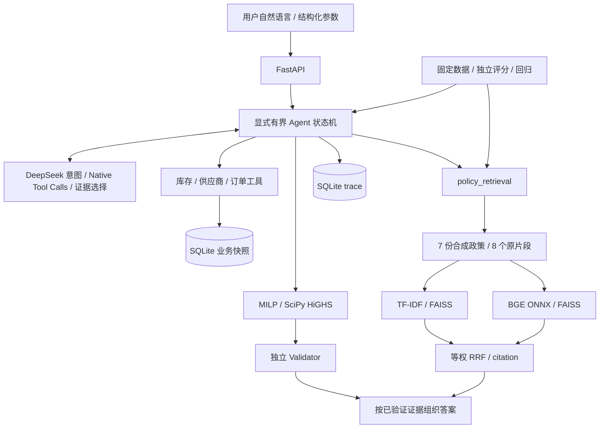

# SupplyChain Decision Agent · LLM + 运筹优化

个人供应链决策实践：**DeepSeek 理解需求并调用工具，SQLite 提供业务事实，MILP 生成补货方案，独立 Validator 校验后发布，RAG 提供原文依据。**

使用 **synthetic / demo data**，包含 **AI-assisted development**。不是 ABB 内部系统（not an ABB internal system），不包含 ABB 机密数据（contains no ABB confidential data），没有企业上线或真实业务降本证据。

## 当前冻结状态

`PROJECT_FROZEN_FOR_2027_CAMPUS_RECRUITING`。API 默认 **hybrid retrieval**，lexical 与 semantic 可显式选择。[默认策略](RETRIEVAL_BACKEND_DECISION.md) · [最终报告](AGENT_V2_FINAL_REPORT.md) · [冻结决策](FINAL_FREEZE_DECISION.md) · [简历与面试素材](RESUME_AGENT_V2_EVIDENCE.md)

| 验证 | 实际结果 | 证据 |
| --- | --- | --- |
| 完整测试 | 313 passed，0 fail/error/skip；本轮基线 313，新增 0 项 | [最终验证](evaluation/release/verification.json) |
| 真实 DeepSeek，固定 Agent 留出 24 条 | lexical 22/24，hybrid 22/24，semantic 21/24 | [原始索引](evaluation/retrieval_backend_e2e_results.json) |
| 独立检索，固定留出 12 条 | hybrid Hit@1 11/12、Hit@3 12/12、Recall@3 0.9583 | [全部三路结果](evaluation/release/retrieval/summary.json) |
| 原离线回归 | V1 36 条、V2 demo 38 条逐例评分不变 | [回归结果](evaluation/release/regression/summary.json) |
| Docker | Linux ARM64 实测 build/run、断网离线、真实 DeepSeek、重启通过 | [实际检测](DOCKER_RUNTIME_VERIFICATION.md) |

这两个留出集均为小样本固定合成评测、由同一 AI 辅助过程编写，不是新增盲测或生产准确率。Hybrid **没有提高本次 Agent E2E 成功数**；它改善了独立检索覆盖，同时增加时延与 token 用量。

## 业务问题与 Why LLM + OR

给定库存、在途订单、需求、单价、MOQ、供货上限、交期和预算，决定每个 SKU 的整数采购量。目标最小化采购、期末持有和缺货惩罚之和。合成场景含 5 个 SKU、3 家固定供应商和 3 条采购订单。

LLM 负责自然语言理解、受限 planning/routing 和最终解释的证据选择；库存事实来自数据库，整数约束与预算由求解器处理，模型不能凭文字生成可信采购数量。查询和优化共享可追溯快照，实际下单、付款和修改主数据不属于系统能力。

## 架构



## Agent Workflow

`load_snapshot → detect_intent → 按状态开放工具 → 查询数据与政策 → optimizer proposal → validator → 选择证据 → 渲染答案 → 保存终态`。

LLM 选择意图、工具顺序/批次、参数和最终证据 ID；状态机验证先决条件，最多 10 次工具尝试、12 次模型调用、2 次总重规划/修复，每个批次最多 4 个工具。HTTP 和可重试工具最多各重试 1 次。请求预算 60 秒，普通同步工具执行后检查耗时，不是进程级强制中断。

| 任务 | 行为 |
| --- | --- |
| 库存/供应商/订单/政策查询 | 对应只读工具，不调用 solver |
| 优化或查询后优化 | 先读取全部库存/供应商和政策，再求解并校验 |
| 信息不足 / 不支持条件 | needs_clarification，不发布方案 |
| 绕过约束 / 下单 / 修改主数据 | rejected |
| Solver infeasible | 保持原约束，说明阻碍条件 |
| 模型/工具/校验失败或超限 | 终止并保存 trace，隐藏未经确认的方案 |

`demo` 是保守句式 DSL，`llm` 是真实 API，失败不回退 demo。`previous_request_id` 只关联记录，澄清后应提交完整替换条件，不自动合并多轮约束。

## 六个业务工具

| Tool | 职责 |
| --- | --- |
| inventory_query | 现货、需求和计划窗口内在途 |
| supplier_query | 固定供应商资质、单价、MOQ、上限、交期 |
| order_query | 只读已有订单，允许空结果 |
| policy_retrieval | query/top-k → 排名、原文 citation、源 hash |
| replenishment_optimizer | 按锁定参数产生 proposal id 与求解结果 |
| solution_validator | 重验 proposal，独立重算数量、约束与汇总成本 |

另有 `finish_request` 结束信号，不计为第七个业务工具。Pydantic 拒绝额外字段和非法参数；数据库查询使用参数化 SQL，LLM 不执行任意 SQL。

## RAG / Lexical Retrieval

原 `PolicyRetriever` 保持不变：Markdown 按 `##` 分段，段内最多 700 字符、无 overlap、前置标题；中文双字和英文词生成 529 维 TF-IDF，经 L2 归一化，用 FAISS `IndexFlatIP` 精确排序。中文原词面检索无需模型下载。应用启动时建立小型内存索引，政策/片段附带 SHA-256。

RAG 提供原文依据，**不会把任意文档编译成 MILP 硬约束**。检索所得 citation 和模型最终选择的证据分别记录；代码渲染事实和原文，不宣称自由文本推理已经自动验证。

## Semantic Retrieval

使用 [BGE-small-zh-v1.5](https://huggingface.co/BAAI/bge-small-zh-v1.5) 的固定 [ONNX 导出](https://huggingface.co/Xenova/bge-small-zh-v1.5/tree/75c43b069aac4d136ba6bc1122f995fedcfd2781)：512 维、FP32、CPUExecutionProvider、CLS pooling、L2 归一化、cosine similarity。Query 使用模型推荐中文检索前缀；文档无前缀。最多 512 tokens，当前片段实际 74–178 tokens，未截断。

模型 revision、3 个文件的大小与 SHA-256 固定；约 95 MB 权重只存于被忽略的 `.runtime/models`，明确下载后才离线加载，不进入 Git 或 image。不存在隐式下载、伪向量或故障时偷偷切换 backend。[完整参数与阶段对照](SEMANTIC_RETRIEVAL_REPORT.md)。

## Hybrid RRF

两路各取 top-5 片段，按 citation ID 合并，等权相加 `1/(60 + rank)`，默认返回 top-3，并列按 citation ID 排序。保存每路排名、原始分数和融合贡献，无 reranker 或学习融合。三路共用原 chunking 与固定数据，没有留出特例。

8 个片段适合两个内存索引，不需要外部向量服务。API 默认 hybrid；没有校准无相关文档的拒答阈值，最近邻不能当成正确性概率。

## MILP Optimization

变量包含整数采购量、期末库存、缺货量和是否订购的二元变量。约束包括库存平衡、非负/整数、MOQ、供货上限、预算、交期、禁止采购、保护物料和逐 SKU 服务下限。[数学定义](docs/model.md)。

预算只限制采购支出，目标函数另含持有与缺货成本。`min_service_level` 要求每个 SKU 分别达标，最低满足量向上取整；总体 fill_rate 仅为展示。窗口内 in_transit 加入库存，received 不重复计入，cancelled 不计入；inactive 供应商不能新增采购。

## Independent Validation

Validator 不读取求解矩阵，使用可信快照重算完整 SKU 集合的数量、MOQ、预算、交期和服务条件；V2 另检查汇总成本及 fill_rate。可行 proposal 验证后才可出现在最终 result；生成解释失败仍会隐藏方案。不能用“少发布方案”的高 validator 通过率替代端到端成功率。

## Evaluation

| 固定 retrieval 留出 12 条 | Hit@1 | Hit@3 | Recall@3 |
| --- | --- | --- | --- |
| lexical | 10/12 | 11/12 | 0.8750 |
| semantic | 8/12 | 12/12 | 0.9583 |
| hybrid | 11/12 | 12/12 | 0.9583 |

开发集 6 条三路 Hit@1 / Hit@3 均为 6/6，Recall@3 均为 1.0。Hit 是至少命中一份相关文档；Recall 先截断片段再去重文档，按问题平均。存在一条双相关文档问题只命中其中一份，所以 Recall@3 不是 100%。

真实 DeepSeek `deepseek-v4-flash` 同一固定 24 条请求：lexical 22/24、hybrid 22/24、semantic 21/24。各自 p50/p95 为 3.654/8.060、4.089/9.275、3.726/8.343 秒，仅适用于这次顺序小样本。逐例成功/失败、调用、token、分母和分类见 [E2E 报告](evaluation/retrieval_backend_e2e_report.md)。模型费用缺可靠缓存用量拆分，金额记 null。

Core 历史 22/24 与本次运行分开保留。数据不是第三方盲测；不改答案，不挑成功案例，不以留出结果调规则。Hybrid 仍有最终政策引用失败与显式 7 天参数抽取失败。默认取舍见 [决策记录](RETRIEVAL_BACKEND_DECISION.md)。

## Testing

本轮完整 **313 passed**，与 Final 基线相同，新增 0 项；容器生命周期使用实际 HTTP 验证脚本，未以重复单测堆数量。包括 4 项显式真实模型集成测试，0 fail/error/skip；两条现有 Starlette/httpx、anyio 弃用警告保留。Ruff 与独立证据检查通过。

原 V1 36 条和 V2 demo 38 条重新执行，逐例评分一致；V2 demo dev 14/14、heldout 17/24 保留原失败。完整验证重算 72 条真实 E2E 响应，不把重验称为额外在线实验。

## Quick Start

Python 3.12 与 uv，进入 `supplychain-agent` 目录，先完成默认 hybrid 的准备：

```bash
uv sync --python 3.12 --extra dev --extra semantic --frozen
.venv/bin/python scripts/prepare_embeddings.py
.venv/bin/python scripts/prepare_embeddings.py --verify-only
RUN_EMBEDDING_INTEGRATION=1 .venv/bin/python -m pytest
.venv/bin/uvicorn supplychain_agent.api:app --host 127.0.0.1 --port 8765
```

只有 prepare 步骤下载固定模型；无 LLM key 也可运行 demo。运行环境只读取进程变量，不自动读取 `.env`；示例见 [.env.example](.env.example)。真实模式使用现有环境的 `DEEPSEEK_API_KEY`；自定义兼容服务须显式配置其 URL 和专属 `LLM_API_KEY`。

不准备 embedding 的最小 lexical 路径：

```bash
uv sync --python 3.12 --extra dev --frozen
AGENT_RETRIEVAL_BACKEND=lexical .venv/bin/uvicorn supplychain_agent.api:app --host 127.0.0.1 --port 8765
```

未准备模型/semantic extra 时不能启动默认 hybrid；这是显式依赖要求，不会静默降级。普通单元测试若不用模型，应显式设置 `AGENT_RETRIEVAL_BACKEND=lexical`；只有准备模型并设置 `RUN_EMBEDDING_INTEGRATION=1` 的完整运行才能使用 313 passed 的验收口径。

## API 与 Example Request

[本机 OpenAPI](http://127.0.0.1:8765/docs)。V1 `/agent`、`/plan`、`/scenarios` 等保留；V2 提供 `/v2/agent`、`/optimize`、`/v2/health`、`/v2/runs`、`/v2/runs/{request_id}`。请求包含 X-Request-ID；非法输入 422、容量耗尽 429、审计失败 503。

```bash
curl http://127.0.0.1:8765/v2/agent -H 'Content-Type: application/json' \
  -d '{"message":"查询库存：电机和传感器","mode":"demo"}'
curl http://127.0.0.1:8765/v2/agent -H 'Content-Type: application/json' \
  -d '{"message":"先查询库存，再预算9000元，电机不能缺货","mode":"llm"}'
curl http://127.0.0.1:8765/optimize -H 'Content-Type: application/json' \
  -d '{"parameters":{"budget":9000}}'
```

## Example Trace 与复现

[本轮真实 Docker trace](evaluation/release/docker/live.json)：用户“先查询库存，再预算9000元，电机不能缺货” → intent `query_then_optimize`（budget=9000，protected=MOTOR） → `inventory_query → supplier_query → policy_retrieval`（hybrid，预算/审批/服务等原文引用） → `replenishment_optimizer`（optimal，合成采购金额8992） → `solution_validator`（valid，139 checks） → HTTP 200 / completed。该次 DeepSeek 7 次调用、8.82 秒，单次演示不属于统计评测。完整 trace 保留模型意图、工具参数/结果与原文 citation。

```bash
.venv/bin/python -m supplychain_agent.v2.semantic_evaluation --output .runtime/retrieval-reproduction-01
.venv/bin/python scripts/regress_semantic.py --output .runtime/regression-reproduction-01
# 重新调用真实 API，需要有效凭据；使用新父目录，保留全部历史。
.venv/bin/python scripts/evaluate_retrieval_backends.py --output .runtime/e2e-reproduction-01/raw
# 以下命令离线核验本次已保存的冻结证据，不调用 API。
.venv/bin/python scripts/verify_release.py
```

完整历史一致性核验需保留本分支 Git 历史；仅下载公开项目快照仍可运行测试/演示，但不能访问旧 Git 锚点。原 Core / Semantic / Final 校验脚本属于相应 checkpoint，机器元数据脱敏后以新 release gate 核实受限变换，不重写旧 manifest。[Core 协议](evaluation/PROTOCOL_V2.md) 和 [Semantic 协议](evaluation/semantic_v2/PROTOCOL.md) 保留。

## Docker

**已在 Docker Desktop / Linux ARM64 验证。** 从干净解包目录执行，无宿主 Python/模型依赖；[实测命令与证据](DOCKER_RUNTIME_VERIFICATION.md)。默认包含已锁定 semantic extra，准备阶段公开下载约95 MB固定模型，此后离线推理。SQLite卷持久化，模型卷只读。

```bash
docker build -t supplychain-agent:v2 .
docker run --rm -v supplychain-bge:/models/bge --entrypoint python \
  supplychain-agent:v2 scripts/prepare_embeddings.py --model-dir /models/bge
docker run -d --name supplychain-agent-v2 -p 127.0.0.1:8765:8765 \
  -v supplychain-data:/app/.runtime -v supplychain-bge:/models/bge:ro \
  -e AGENT_EMBEDDING_MODEL_DIR=/models/bge supplychain-agent:v2
# 等待 /v2/health 返回 200 后再请求；无 key 可执行 demo 和 /optimize。
curl --fail http://127.0.0.1:8765/v2/health
curl --fail http://127.0.0.1:8765/v2/agent -H 'Content-Type: application/json' \
  -d '{"message":"查询库存：电机","mode":"demo"}'
curl --fail http://127.0.0.1:8765/optimize -H 'Content-Type: application/json' \
  -d '{"parameters":{"budget":9000}}'
docker stop supplychain-agent-v2
docker start supplychain-agent-v2
```

真实 DeepSeek：先在当前终端安全配置已有 `DEEPSEEK_API_KEY`，再启动独立容器（不把值写入命令）：

```bash
docker run -d --name supplychain-agent-v2-live -p 127.0.0.1:8766:8765 \
  -v supplychain-live-data:/app/.runtime -v supplychain-bge:/models/bge:ro \
  -e AGENT_EMBEDDING_MODEL_DIR=/models/bge --env DEEPSEEK_API_KEY supplychain-agent:v2
# 等待 /v2/health 后执行；llm 失败不切换 demo。
curl --fail http://127.0.0.1:8766/v2/agent -H 'Content-Type: application/json' \
  -d '{"message":"先查询库存，再预算9000元，电机不能缺货","mode":"llm"}'
```

最小无模型镜像仍可 `--build-arg WITH_SEMANTIC=0`，运行时显式 `-e AGENT_RETRIEVAL_BACKEND=lexical`。自动重演断网离线、embedding、restart和可用key下真实请求：`python3 scripts/verify_docker_runtime.py --model-volume supplychain-bge --output .runtime/docker-reproduction-01`（输出目录必须不存在）。本轮验证过的镜像/模型卷被保留，验证脚本创建的容器和SQLite卷已清理。

公开当前项目快照前阅读 [安全审计](PUBLIC_REPO_SAFETY_AUDIT.md)：旧 Git 历史仍有机器元数据；只导出已提交项目树，勿直接公开整个求职材料仓库。

## Limitations

- 24 条 Agent 与 12 条 retrieval 均为固定小型合成集，没有第三方独立标注、企业分布或生产并发验证。
- 意图/工具指标包含状态机掩码和防护，不是无约束模型能力。检索正确不保证最终答案证据选择成功。
- 单期确定性 MILP，不保证逐日库存安全，不做需求预测、多供应商分配或随机优化；critical 标签不自动强制保护。
- 普通同步工具无独立进程硬超时；SQLite trace 不等于防篡改存储或长任务恢复；无多租户鉴权。
- 无 reranker、模型微调、Multi-Agent、Kubernetes、Redis、Kafka、ERP 接入或业务收益证明。Docker 仅验证本地 ARM64，没有云端或生产部署。

`PROJECT_FROZEN_FOR_2027_CAMPUS_RECRUITING` · `NO_ADDITIONAL_PROJECT_FEATURES_REQUIRED`。项目可如实投递，后续准备重点见 [校招缺口审计](CAMPUS_RECRUITING_GAP_AUDIT.md)。
