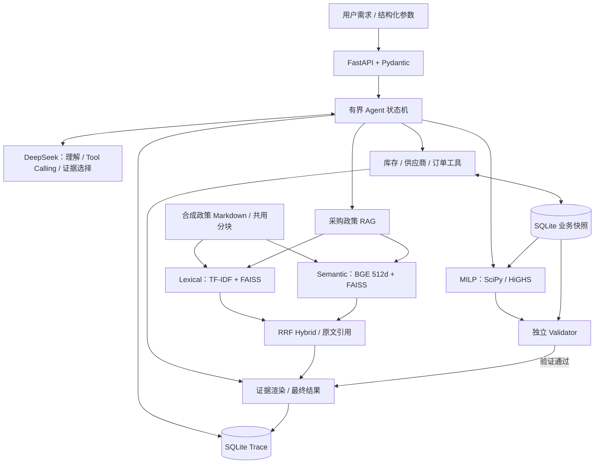
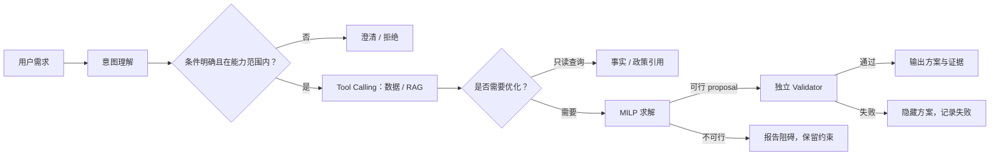
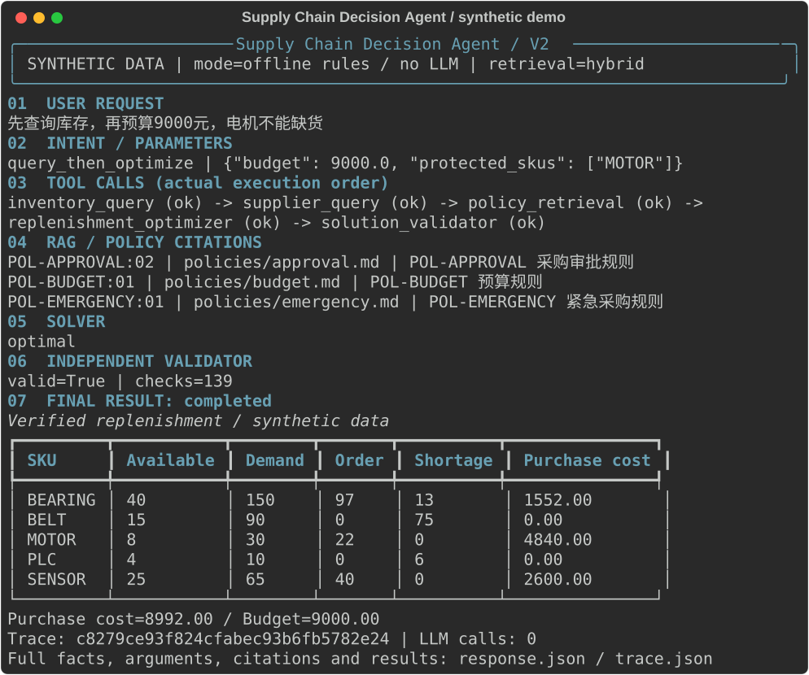

# Supply Chain Decision Agent

**面向供应链补货的 LLM + 运筹优化（OR）决策 Agent。** 将自然语言需求转化为可追溯、可求解、可独立验证的补货建议：DeepSeek 理解意图并调用工具，RAG 检索采购政策，MILP 计算采购量，Validator 验证方案后输出决策。

> **6 类业务工具 · Hybrid Agent E2E 22/24 · 检索 Hit@1 11/12 · 313 tests passed**
>
> 数字来自已保存的 Final Release 验证记录；评测采用固定合成留出集，具体口径与失败案例见下文。

[快速运行](#quick-start) · [验证结果](#evaluation) · [Demo](#demo) · [面试准备](docs/interview.md) · [最终技术报告](AGENT_V2_FINAL_REPORT.md)

## Problem：带业务约束的补货决策

“先查询库存，再预算 9000 元，电机不能缺货。”这类需求同时涉及库存、在途订单、供应商资质、MOQ、预算、交期和服务水平。系统需要先查清事实，再判断约束是否可行，最后给出采购建议及政策依据。

本项目使用 **5 个 SKU、3 家固定供应商、3 条采购订单的 synthetic/demo data**，实现单期补货决策闭环。目标是最小化采购、期末持有和缺货惩罚之和；采购建议不触发实际下单、付款或主数据修改。

## Why LLM + OR

| 组件 | 负责的工作 |
| --- | --- |
| **LLM / DeepSeek** | 意图理解、受限规划与路由、原生 Tool Calling、澄清/拒绝，以及最终解释的证据选择 |
| **确定性数据工具** | 从 SQLite 查询库存、供应商和订单，提供同一次运行使用的业务快照 |
| **RAG** | 检索采购政策，返回原文片段、引用 ID 和来源 hash |
| **MILP Solver** | 在明确的数学约束下求解整数采购量，返回 optimal 或 infeasible 等状态 |
| **独立 Validator** | 根据可信业务快照重新核算约束、成本与满足率，控制方案是否可以发布 |

**采购数量与最优性由求解器计算，LLM 不自行计算优化答案。** 政策检索提供依据，不会把任意检索文本自动转换为 MILP 硬约束。

## Architecture



### Agent 工作流程

**用户需求 → LLM 理解 → Tool Calling → 数据查询与 RAG 检索 → 优化求解 → Validator 验证 → 输出决策并保存 Trace。**

以上是优化请求的主流程；Agent 根据意图选择执行路径，而非每个问题都调用求解器。



| 请求或状态 | 实际行为 |
| --- | --- |
| 库存、供应商、订单、政策查询 | 调用对应只读工具，直接返回事实或引用 |
| 补货优化 / 先查询再优化 | 读取库存、供应商和政策，再执行 Solver → Validator |
| 信息不足或不支持的条件 | 返回 `needs_clarification`，不发布方案 |
| 要求绕过约束、下单或修改主数据 | 返回 `rejected` |
| 约束不可行 | 保留原条件并说明阻碍，不自动放宽预算或服务要求 |
| 模型、工具或校验失败 | 在有界重试后终止，记录失败并隐藏未经确认的方案 |

状态机限制工具和模型调用次数，校验工具先决条件与 Pydantic 参数。`llm` 模式调用真实 API，失败不静默回退；`demo` 模式使用保守的规则句式，不需要 LLM Key。

## 核心模块与项目亮点

### 1. 六类工具，连接业务事实与优化决策

| Tool | 职责 |
| --- | --- |
| `inventory_query` | 查询现货、需求和计划窗口内在途数量 |
| `supplier_query` | 查询资质、单价、MOQ、供货上限与交期 |
| `order_query` | 查询已有订单记录 |
| `policy_retrieval` | 检索采购政策，返回排序与原文引用 |
| `replenishment_optimizer` | 按锁定参数生成补货 proposal 与求解结果 |
| `solution_validator` | 独立重验 proposal 的约束与汇总指标 |

`finish_request` 是结束信号，不计入业务工具数量。数据查询使用参数化 SQL，LLM 不执行任意 SQL。

### 2. 可对照评测的 RAG：保留 baseline，显式选择 backend

三种检索方式共用 **7 份政策、8 个片段**：按 Markdown `##` 分段，段内最多 700 字符、无重叠、前置标题。

| Backend | 实现 |
| --- | --- |
| `lexical` | 保留原 TF-IDF baseline，中文双字与英文词特征，L2 归一化后使用 FAISS `IndexFlatIP` |
| `semantic` | BGE-small-zh-v1.5，512 维 FP32 embedding，ONNX Runtime CPU 推理，CLS pooling + L2 归一化；FAISS 内积等价于 cosine similarity |
| `hybrid`（默认） | 两路各取 top-5，按片段引用 ID 进行等权 RRF：`sum(1 / (60 + rank))`，默认返回 top-3 |

模型 revision、文件大小与 SHA-256 固定；显式下载后离线加载，不把模型缓存放入 Git 或镜像。检索保留原始排名和融合贡献，便于分析词面匹配与语义匹配的取舍。[完整参数与评测](SEMANTIC_RETRIEVAL_REPORT.md) · [默认 hybrid 的决策依据](RETRIEVAL_BACKEND_DECISION.md)。

### 3. MILP + 独立验证，约束贯穿整个决策流程

整数采购量、期末库存、缺货量与订购二元变量构成单期 MILP。约束覆盖库存平衡、MOQ、供货上限、预算、交期、禁止采购、保护物料和逐 SKU 服务下限；使用 **SciPy / HiGHS** 求解。[数学模型](docs/model.md)。

Validator 不读取求解矩阵，而是从业务快照重算数量、约束与成本。预算仅限制采购支出；持有与缺货成本计入目标函数。服务下限按 SKU 检查，总体满足率用于展示。方案通过验证后才允许发布，解释生成失败也会隐藏方案。

### 4. 可追溯的 AI 应用工程

FastAPI 提供请求与 Trace 查询接口，Pydantic 校验输入和工具协议，SQLite 保存业务快照与运行轨迹。Trace 包含意图、工具参数/结果、检索引用和终态；Docker 支持独立运行及数据卷持久化，离线模式与真实 DeepSeek 模式分别验证。

## 技术栈与代码导航

| 层次 | 技术 | 入口 |
| --- | --- | --- |
| Agent / Tool Calling | Python、DeepSeek、显式状态机、Pydantic | [agent.py](src/supplychain_agent/v2/agent.py)、[model.py](src/supplychain_agent/v2/model.py)、[tools.py](src/supplychain_agent/v2/tools.py) |
| RAG / Embedding | TF-IDF、BGE、ONNX Runtime、FAISS、RRF | [retrieval.py](src/supplychain_agent/v2/retrieval.py)、[semantic_retrieval.py](src/supplychain_agent/v2/semantic_retrieval.py)、[embeddings.py](src/supplychain_agent/v2/embeddings.py) |
| Optimization / Validation | MILP、SciPy、HiGHS | [optimizer.py](src/supplychain_agent/optimizer.py)、[tools.py](src/supplychain_agent/v2/tools.py) |
| API / 存储 | FastAPI、SQLite、SQL | [api.py](src/supplychain_agent/v2/api.py)、[database.py](src/supplychain_agent/v2/database.py)、[trace.py](src/supplychain_agent/v2/trace.py) |
| 测试 / 运行 | Pytest、uv、Docker | [tests](tests)、[evaluation](evaluation)、[Dockerfile](Dockerfile)、[uv.lock](uv.lock) |

## Quick Start

以下命令均在 `supplychain-agent/` 项目目录执行，使用 Python 3.12 与 uv。首次安装依赖、下载模型需要联网；准备完成后的 `demo` 推理不需要 LLM API。

完整环境变量、Make 命令、健康检查与故障排查见 [运行与复现指南](docs/running.md)。

### 本地离线模式：先运行 lexical baseline

```bash
uv sync --python 3.12 --extra dev --frozen
AGENT_RETRIEVAL_BACKEND=lexical .venv/bin/uvicorn supplychain_agent.api:app --host 127.0.0.1 --port 8765
```

在另一个终端检查服务并发起请求：

```bash
curl --fail http://127.0.0.1:8765/v2/health
curl --fail http://127.0.0.1:8765/v2/agent -H 'Content-Type: application/json' \
  -d '{"message":"查询库存：电机和传感器","mode":"demo"}'
curl --fail http://127.0.0.1:8765/optimize -H 'Content-Type: application/json' \
  -d '{"parameters":{"budget":9000}}'
```

### 启用默认 hybrid retrieval

停止前一个服务，安装 semantic 依赖并准备固定模型，再启动：

```bash
uv sync --python 3.12 --extra dev --extra semantic --frozen
.venv/bin/python scripts/prepare_embeddings.py
.venv/bin/python scripts/prepare_embeddings.py --verify-only
AGENT_RETRIEVAL_BACKEND=hybrid .venv/bin/uvicorn supplychain_agent.api:app --host 127.0.0.1 --port 8765
```

未准备 embedding 依赖或权重时，默认 hybrid 会明确报错，不会静默降级。可用 `AGENT_RETRIEVAL_BACKEND=semantic` 单独运行语义检索。

### 真实 DeepSeek 模式

在启动服务的终端安全配置进程环境变量 `DEEPSEEK_API_KEY`，然后启动或重启服务，再发送 `mode=llm` 请求：

```bash
curl --fail http://127.0.0.1:8765/v2/agent -H 'Content-Type: application/json' \
  -d '{"message":"先查询库存，再预算9000元，电机不能缺货","mode":"llm"}'
```

配置项见 [.env.example](.env.example)；程序不自动加载 `.env`。不要将真实 Key 写入源码、README 或 Git。Live 模式需要外部 API 连接，并产生模型调用用量。

API 文档：启动后访问 `http://127.0.0.1:8765/docs`。主要接口为 `/v2/agent`、`/optimize`、`/v2/health`、`/v2/runs` 和 `/v2/runs/{request_id}`；响应头 `X-Request-ID` 可用于定位 Trace。

### Docker / offline

```bash
docker build -t supplychain-agent:v2 .
# 首次准备模型卷；完成后服务只读挂载。
docker run --rm -v supplychain-bge:/models/bge --entrypoint python \
  supplychain-agent:v2 scripts/prepare_embeddings.py --model-dir /models/bge
docker run -d --name supplychain-agent-v2 -p 127.0.0.1:8765:8765 \
  -v supplychain-data:/app/.runtime -v supplychain-bge:/models/bge:ro \
  -e AGENT_EMBEDDING_MODEL_DIR=/models/bge supplychain-agent:v2
curl --fail http://127.0.0.1:8765/v2/health
```

本地服务与容器使用同一端口，启动容器前先停止本地服务。等待 health 返回 200 后，执行上面的 `demo` 和 `/optimize` 请求。需要容器内 live 模式时，在 `docker run` 的镜像名之前加入 `--env DEEPSEEK_API_KEY`，从终端传入已配置的变量，不把 Key 值写进命令。

**历史实测：Docker Desktop / Linux ARM64 的 build/run、`/health`、离线模式、真实 DeepSeek、BGE/FAISS 和容器重启均 PASS。** 这是本地容器验证，不是云端或生产部署。[实测记录](DOCKER_RUNTIME_VERIFICATION.md)。

## Demo

### 一条命令运行 V2 并导出截图

完成本地依赖安装后，运行 `make demo-v2`，或：

```bash
.venv/bin/python scripts/demo_v2.py
# 已准备 BGE 后可显式启用 hybrid；解析仍为离线规则，不调用 LLM。
.venv/bin/python scripts/demo_v2.py --backend hybrid
```

默认使用 `demo + lexical`，不需要 Key。脚本直接调用现有 V2 Agent，展示实际意图、工具执行、检索引用、求解、验证与采购明细；每次在新的 `.runtime/demo-v2-*` 目录生成 HTML、SVG、JSON 和 SQLite Trace。真实模式可显式指定 `--mode llm --backend hybrid`，需配置 Key；不会伪装成功或覆盖旧输出。[演示与截图指南](docs/demo.md)。

下图来自一次真实本地执行，**offline rules + hybrid / LLM calls=0**；仅用合成数据，不代表真实 LLM 评测成绩。[对应原始响应](docs/assets/demo-v2.response.json)。



### A. 库存查询：按意图选择最短路径

```text
User Request：查询库存：电机和传感器（mode=demo）
→ Intent：inventory
→ Tool Calls：inventory_query
→ Retrieval / Solver / Validator：本次只读查询不调用
→ Final Result：返回对应 SKU 的库存事实与业务快照依据，保存 Trace
```

对应请求见 Quick Start；无 LLM Key 也可复现。

### B. 补货优化：真实 DeepSeek + hybrid

以下为[已保存的 Docker live trace](evaluation/release/docker/live.json)，全部业务数据为合成数据：

```text
User Request：先查询库存，再预算9000元，电机不能缺货
→ Intent：query_then_optimize；budget=9000，protected_skus=[MOTOR]
→ Tool Calls：inventory_query → supplier_query → policy_retrieval
→ Retrieval：hybrid，返回预算、审批、服务等政策原文引用
→ Solver：replenishment_optimizer，status=optimal，采购支出=8992
→ Validator：solution_validator，valid，139 项检查
→ Final Result：HTTP 200 / completed，发布已验证方案与证据，保存 Trace
```

139 项检查是该次方案的验证明细数量，不代表每个请求都有相同数量。真实模型再次运行时，调用顺序与输出可能变化；单次演示不替代端到端评测。

## Evaluation

以下均为 **Final Release 已保存的验证结果**，并非本次 README 编辑重新运行的实验。开发集与留出集固定，使用 **fixed synthetic held-out dataset**；数据由同一 AI 辅助过程编写，不是第三方独立盲测，也不能外推为生产准确率。

### Retrieval：同一固定留出集 12 条

| Backend | Hit@1 | Hit@3 | Recall@3 |
| --- | --- | --- | --- |
| lexical | 10/12 | 11/12 | 0.8750 |
| semantic | 8/12 | 12/12 | 0.9583 |
| hybrid | **11/12** | **12/12** | **0.9583** |

开发集 6 条：三路 Hit@1、Hit@3 均为 6/6，Recall@3 均为 1.0。Hit 表示至少命中一份相关文档；Recall 按每个问题的相关文档召回率平均。多相关文档问题可能只召回其中一份，因此 **Hit@3 12/12 不等于“100% RAG accuracy”**。[三路评测结果](evaluation/release/retrieval/summary.json)。

### Agent E2E：真实 DeepSeek，同一固定留出集 24 条

| Retrieval backend | 端到端成功 |
| --- | --- |
| lexical | 22/24 |
| semantic | 21/24 |
| hybrid | 22/24 |

保存记录中的模型为 `deepseek-v4-flash`。Hybrid 改善本次独立检索结果，但 **Agent E2E 成功数与 lexical 持平**，且时延与 token 用量更高。两个 hybrid 失败案例分别涉及显式 7 天参数抽取、最终政策引用；失败原样保留。[逐例结果与诊断](evaluation/retrieval_backend_e2e_report.md) · [原始结果索引](evaluation/retrieval_backend_e2e_results.json)。

## Testing

Final Release 完整验证记录为 **313 passed，0 failed / errors / skipped**，其中包含 4 项真实 embedding 集成测试。[验收记录](evaluation/release/verification.json)。

测试覆盖参数协议、Agent 路由与工具调用、澄清/拒绝和失败处理、MILP 约束与不可行场景、独立 Validator、FastAPI、SQLite Trace、三路检索及评测回归。Docker 生命周期另用实际 HTTP 请求验证。

安装 semantic 依赖并完成模型准备后，运行完整测试：

```bash
RUN_EMBEDDING_INTEGRATION=1 .venv/bin/python -m pytest
```

不准备模型时可运行 `AGENT_RETRIEVAL_BACKEND=lexical .venv/bin/python -m pytest`，但真实 embedding 集成测试会跳过，不能套用 313 项全部通过的口径。

原离线回归逐例评分保持一致：V1 共 36 条，V2 demo 开发集 14/14、留出集 17/24；demo 不等同于真实 LLM 的端到端能力。[回归记录](evaluation/release/regression/summary.json)。检索与离线评测可输出至新的运行目录：

```bash
.venv/bin/python -m supplychain_agent.v2.semantic_evaluation --output .runtime/retrieval-reproduction-01
.venv/bin/python scripts/regress_semantic.py --output .runtime/regression-reproduction-01
```

## Limitations

- 使用合成业务数据与小型固定评测集，没有企业生产流量、真实业务收益或生产并发验证。
- 当前范围是单领域供应链决策支持；单期确定性 MILP 不包含需求预测、逐日库存模拟或多供应商分配。
- Live 模式依赖 DeepSeek；正确检索不保证最终证据选择正确，未校准无相关文档的拒答阈值。
- 普通同步工具没有进程级硬超时；SQLite Trace 不提供防篡改存储或长任务恢复；无多租户鉴权。
- `previous_request_id` 仅关联历史记录；澄清后需提交完整替换条件，不自动合并多轮约束。

## 未来工作（尚未实现）

当前功能保持冻结。后续研究可优先扩大独立标注的评测集、校准检索无相关结果时的拒答阈值，并研究多期库存与需求不确定性建模。以上是改进方向，不计入当前能力或评测成绩；上线所需的鉴权、并发与运维验证也尚未完成。

## Disclaimer 与发布状态

Personal project，包含 AI-assisted development；**Not an ABB internal system. Contains no ABB confidential data.** 所有业务数据均为 synthetic/demo data。

功能已冻结：`PROJECT_FROZEN_FOR_2027_CAMPUS_RECRUITING`。本 README 仅整理既有能力与证据。[最终报告](AGENT_V2_FINAL_REPORT.md) · [冻结记录](FINAL_FREEZE_DECISION.md)。

公开发布请使用干净项目快照：当前项目树已完成安全审计，但旧 Git 历史未完成脱敏，不应直接公开整个求职材料仓库。[安全审计与发布边界](PUBLIC_REPO_SAFETY_AUDIT.md)。
